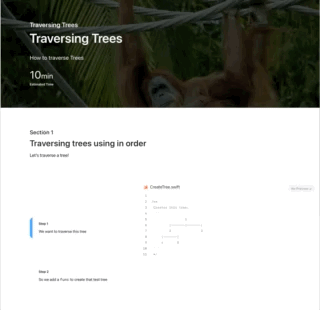

# Notice: Repository Deprecation
This repository is deprecated and no longer actively maintained. It contains outdated code examples or practices that do not align with current MongoDB best practices. While the repository remains accessible for reference purposes, we strongly discourage its use in production environments.
Users should be aware that this repository will not receive any further updates, bug fixes, or security patches. This code may expose you to security vulnerabilities, compatibility issues with current MongoDB versions, and potential performance problems. Any implementation based on this repository is at the user's own risk.
For up-to-date resources, please refer to the [MongoDB Developer Center](https://mongodb.com/developer).

# Realm Binary Tree generated DocC Documentation Package 

DocC package for the [Realm MongoDB Powered Tree Library](https://github.com/mongodb-developer/realm-binary-tree).

You can read a series of posts about how to create a small guessing game in the Realm/MongoDB blog, starting with [Creating a framework that uses Realm as a 3rd party dependency](https://www.mongodb.com/developer/how-to/adding-realm-as-dependency-ios-framework/)

## Demo

Hosted on Netlify [here](https://binary-tree-doc.netlify.app/documentation/)

## Resources

To learn more about Realm/MongoDB you have all these fantastic resources:

- [💻 MongoDB DeveloperHub, central point for everything MongoDB/Realm related](https://www.mongodb.com/developer)
- [💬 The MongoDB Forums](https://www.mongodb.com/community/forums/)
- [👩‍💻 Developer Blog](https://developer.mongodb.com/learn/?content=Articles#main)
- [🎓 MongoDB University](https://university.mongodb.com/)
- [📺 Youtube Channel](https://www.youtube.com/c/MongoDBofficial)
- [🎧 The MongoDB Podcast](https://developer.mongodb.com/learn/?content=Podcasts#main)
